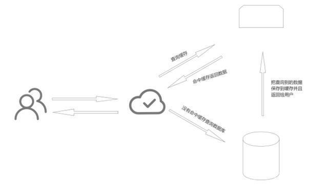

## 一、什么是数据一致性问题？

MySQL入库和Redis入库不是原子操作，Redis入库失败就有问题。

由于需要同时向MySQL和Redis中写入数据，然而两者组合操作并不是原子操作（要么同时成功，要么同时失败），而这两者需要同时向两台服务器写入数据，这就涉及到了双写操作，双写的本质就是为了解决数据一致性。既然说两种的数据保存不是原子操作，那么就会存在入库失败的情况。那么什么情况下会出现这种问题，比如说网络异常，服务器的网络波动，或者说网络中断；内存或磁盘满了。这两者的异常一般情况下不会同时发生，可能是两者之一会发生，那么就导致一个成功，一个失败。那么这就是我们所说的数据一致性问题，所以是先保存Redis还是先保存MySQL呢，下面展开讨论。

### 1.1场景：

双写一致性指的是当我们更新了数据库的数据之后redis中的数据 也要同步去更新。使用redis读取数据的流程，当用户访问数据的时候，会先从缓存中读取数据，如果命中缓存的话，那么直接把缓存中的数据返回给用户，如果缓存中没有数据的话，先查询数据库把查询到的数据保存到缓存中，然后返回给用户。


### 1.2保证双写一致性的策略

1、先更新缓存，再更新数据库

2、先更新数据库，再更新缓存

3、先删除缓存，再更新数据库

4、先更新数据库，再删除缓存

### 1.3四种策略的优缺点

#### 1.3.1先更新缓存，再更新数据库

问题很明显如果更新缓存成功，更新数据库失败，就会造成缓存的脏数据

#### 1.3.2先更新数据库，再更新缓存

如果再高并发的情况下，可能会存在如下的情况，线程A更新了数据库，如果由于网络或者其他的原因，线程A还没来得及更新缓存，这时候有一个进程B更新了数据库，更新了缓存，这时候进程A才更新缓存，这时候就会导致线程B对缓存的更新丢失了，像事务丢失的情况

#### 1.3.3先删除缓存，再更新数据库

这种策略可能已经避免掉了，策略2中缓存丢失的情况，但是再高并发的情况下，也会有不一致的情况，比如线程A做写操作，首先删除缓存然后准备更新数据库，这时候，线程B执行了写操作，没有命中缓存，然后查询数据库，这时候读取的是旧值，并把查询到的旧值保存到缓存中，接着线程A完成了数据库的更新，这时候数据库和缓存又出现了不一致的情况，解决方案：我们只要再线程A，完成数据库的更新之后，稍作延迟再删除一次缓存，也叫作延迟双删。这里的延迟时间一定要大于业务的一次读操作的时间。

#### 1.3.4先更新数据库，再删除缓存

再高并发的情况下，也会有不一致的情况，比如线程A做读取数据的操作，正准备写入缓存的时候，线程B更新了数据库，然后执行了删除缓存的操作，这时候线程A才把旧值写入到缓存中，虽然这种情况出现的概率比较低，因为写操作的时候要大于一次读操作的时间的。解决方案：延迟双删，延时双删还是有问题的，如果删除缓存失败怎么办，当然是再次删除，不断的循环删除。删除失败后我们可以将要删除的key放入到队列中，然后尝试重复删除，直到删除成功。

## 二、如何解决数据一致性问题

```plain
/**
     * 一、普通更新
     *
     * @return
     */
    @Override
    public boolean updateUser1(User user) {
        // 先更新Mysql数据
        boolean result = this.updateById(user);
        // 更新Redis数据
        Long userId = user.getUserId();
        String cacheKey = RedisConstants.createCacheKey(User.class, userId);
        RedisUtils.save(cacheKey, getById(userId));
        return result;
    }
```

代码中使用的是先更新MySQL再更新Redis的操作。先启动项目，将数据查询并缓存到Redis中，然后将Redis停止，修改数据，此时发现MySQL的数据确实更新了，我们再把Redis启动观察，发现Redis中的数据并未更新。那么后续调用接口查询数据都是不正确的，因为在Redis键值并未过期的情况下，我们优先走的是缓存。

```plain
/**
     * 二、Mysql与缓存一致性更新
     */
    @Override
    @Transactional(rollbackFor = Exception.class) // 方法中任何一处发生异常就执行回滚操作
    public boolean updateUser2(User user) {
        // 先更新Mysql数据
        boolean result = this.updateById(user);
        // 更新Redis数据
        Long userId = user.getUserId();
        String cacheKey = RedisConstants.createCacheKey(User.class, userId);
        RedisUtils.save(cacheKey, getById(userId));
        return result;
    }
```

现在我们加入事务注解，一旦代码其中发生任何异常，数据都会回滚。首先将Redis中和MySQL中的数据修改为一致，我们再次重复之前的更新操作，发现MySQL和Redis中的数据并没有进行更新，虽然日志中看到有更新SQL的执行，但是通过事务进行了回滚操作。
